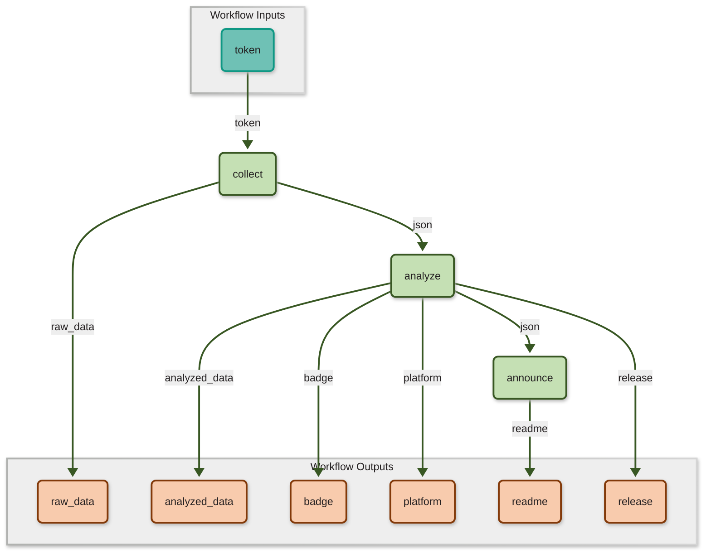

# SciWIn Client Examples
This repo provides all [SciWIn Client](https://github.com/fairagro/m4.4_sciwin_client) Examples from the [Documentation](https://fairagro.github.io/m4.4_sciwin_client/).

## [Getting started example](https://github.com/fairagro/m4.4_sciwin_client_demo_basic/tree/complete_run)
The getting started example is the most basic example provided with SciWIn Client. It creates a simple two-step-workflow without using containerization. It is made to get familiar with the basic capabilities of the `create` and `connect` commands.

Preview Workflow

## [Advanced example](https://github.com/fairagro/m4.4_sciwin_client_demo/tree/complete_run)
The advanced example provides a real world use case using data from the german elections 2025 for the city of brunswick. Herein containerization is used and it is much more focused on how a real project will look like compared to the basic example. The workflow is a complex multiple-step operation which is built in two iterations.

Preview Workflow

## [Corn Prediction](https://github.com/fairagro/m4.4_demo_corn_prediction/tree/run)
This example demonstrates the usage of `s4n`  through a simplified crop yield prediction pipeline that combines soil and weather data to train models and generate county-level yield predictions for Iowa.

Preview Workflow

## [Automated Metrics](https://github.com/fairagro/m4.4_metrics)
An Example Repo where the SciWin-Client Team does collect metrics about the SciWIn-Client by using a Workflow created by SciWin-Client. This Workflow is executed on a regular basis using GitHub Actions.

Preview Workflow

## Coming soon
...
